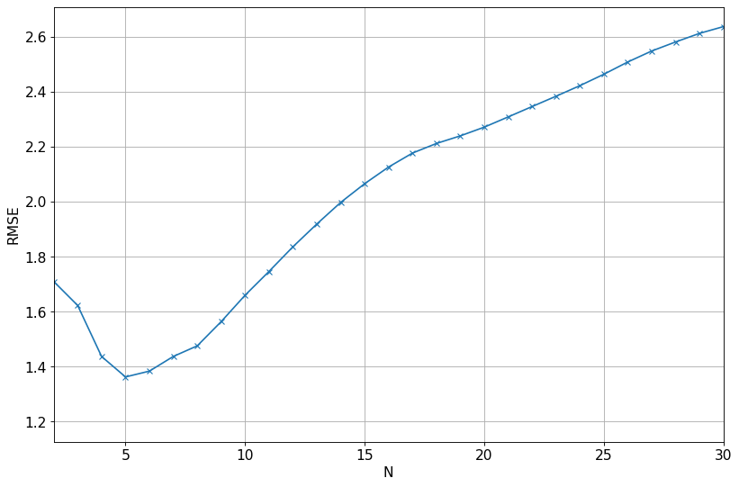
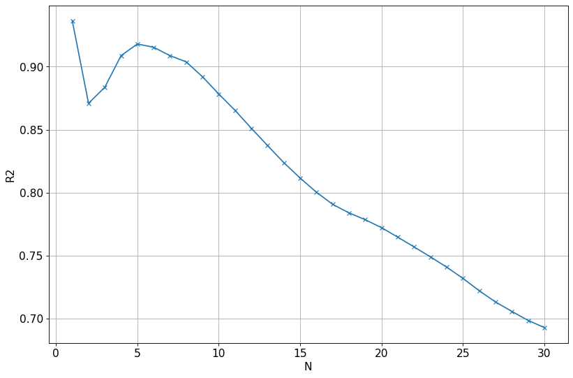

# Stock-Price-Prediction

### Data Exploartion

#### Visualize the Dependent variable with independent variable

### Linear Regression Model
Linear Model:  **linear regression** is a **linear** approach to modeling the relationship between a scalar response (or dependent variable) and one or more explanatory variables (or independent variables). The case of one explanatory variable is called simple **linear regression**.

#### A simple linear regression equation is `y=mx+b`, whereas `m` is the slope/gradient of the polynomial of the line aka `y`( predict coefficient) and `b` is the intercept of the line (bias coefficient).
>

#### Plot Actual vs Predicted Value of Linear Regression Model

### RMSE (Root Mean Square Error)

Root Mean Square Error is the Standard Deviation of residuals, which are a measure of how far data points are from the regression. Or in simple terms how concentrated the data points are around the best fit line.

### R-Squared Error
R-Squared score varies between 0 to 100%.

